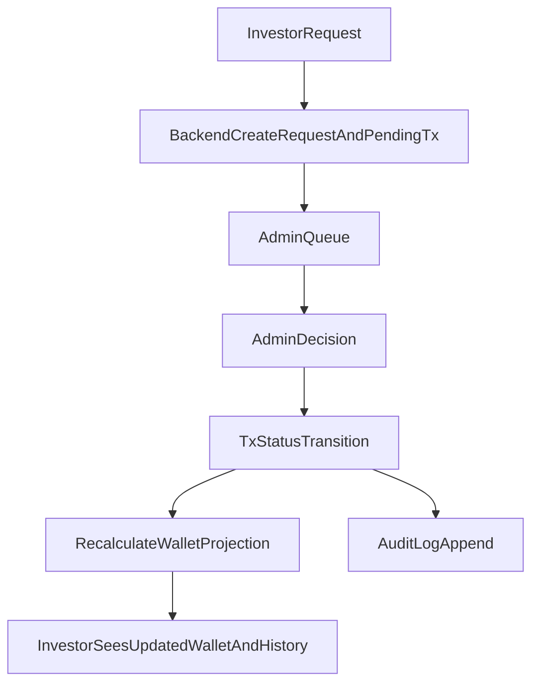

# Wakalat Invest System Alignment Enforcement

## 1) Full Feature Alignment Table

| Feature | Investor Action | Admin Panel Feature | Backend Processing | Ledger Entry | Wallet Impact | Status Flow | Notification Trigger |
|---|---|---|---|---|---|---|---|
| KYC Submission | Submit CNIC, phone, docs | KYC queue + approve/reject | `kyc/{uid}` + admin review writeback | N/A | Gates financial access | `pending -> underReview -> approved/rejected` | KYC reviewed/approved/rejected |
| Deposit Request | Submit amount, method, proof | Pending deposits with approve/reject + reviewed history | `createDepositRequest`, `approveDeposit`, `rejectDeposit` | `transactions(type=deposit)` created at request | Only approved deposit contributes to wallet projection | `pending -> approved/rejected` | submitted, approved, rejected |
| Withdrawal Request | Submit amount | Pending/approved/closed queues + approve/reject/complete | `createWithdrawalRequest`, `approveWithdrawal`, `rejectWithdrawal`, `completeWithdrawal` | `transactions(type=withdrawal)` created at request | Reserved when pending/approved; deducted on completed; released on cancelled | `pending -> approved -> completed` or `pending/approved -> cancelled` | submitted, approved, completed, cancelled |
| View Portfolio | View dashboard/profile summary | Investor detail view | Read-only profile + wallet projection | N/A | Display only | N/A | Optional report/ops notices |
| View Transactions | View wallet/ledger history | Ledger explorer + audit viewer | Read-only `transactions` stream | Must exist for every financial event | Display only | Display status from ledger | status changed |
| View Reports | Open reports module | Upload/publish reports | Read `reports` (admin writes) | N/A | None | report lifecycle (app-defined) | report published |
| Profit Entry (admin) | N/A | Manual posting with note | `addProfitEntry` | `transactions(type=profit,status=approved)` | Increases wallet projection | created approved | posted |
| Adjustment (admin) | N/A | Manual posting with mandatory justification | `addAdjustmentEntry` | `transactions(type=adjustment,status=approved)` | Applies signed delta | created approved | posted |

## 2) Wallet & Ledger Flow Mapping

## 3) Admin Panel Required Features

- Deposits: pending review + reviewed history.
- Withdrawals: pending, approved-awaiting-settlement, closed history.
- Ledger explorer: recent transactions with status visibility.
- Audit viewer: action/entity trail from `audit_logs`.
- Manual controls: profit entry, adjustment entry (mandatory note), wallet recalculation.

## 4) Backend Functions Required

- Request creation: `createDepositRequest`, `createWithdrawalRequest`.
- Admin actions: `approveDeposit`, `rejectDeposit`, `approveWithdrawal`, `completeWithdrawal`, `rejectWithdrawal`.
- Admin postings: `addProfitEntry`, `addAdjustmentEntry`.
- Projection/integrity: `recalculateWalletForUser`, `reconcileWalletsDaily`.
- Trigger safety net: `onTransactionUpdated` -> `recalculateWallet`.

## 5) Status Lifecycle by Transaction Type

- Deposit: `pending -> approved/rejected`
- Withdrawal: `pending -> approved -> completed` or `pending/approved -> cancelled`
- Profit: `approved` at creation
- Adjustment: `approved` at creation

## 6) Critical Errors & Enforcement

- Financial mutation without ledger entry: blocked by server-only writes + callable functions.
- Investor direct write to wallet/transactions/requests: blocked by Firestore rules.
- Missing admin approval step for deposit/withdrawal: enforced by function lifecycle transitions.
- Wallet edited directly: disallowed; wallet is derived from transactions projection.
- Ledger inconsistency risk: mitigated by daily reconciliation + on-write recalculation.

## 7) Recommendations / Test Gates

1. Security gate:
   - verify investor cannot elevate `role` or mutate `kycStatus` in `users`.
2. Financial lifecycle gate:
   - deposit and withdrawal requests always create pending transaction docs.
   - no wallet delta on pending deposit or pending withdrawal completion.
3. Concurrency gate:
   - parallel withdrawal requests must not exceed available funds.
4. Audit gate:
   - every admin financial action produces `audit_logs` entry or error log fallback.
5. Regression gate:
   - OTP, KYC submission, KYC admin review, consent gate remain intact.
